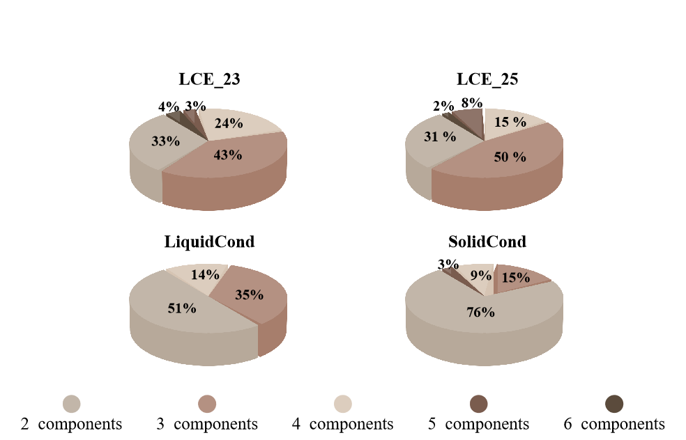
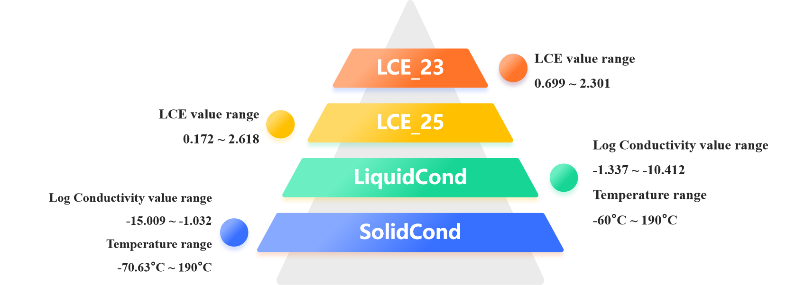

# HiMNN: A Hierarchy-aware Multimodal Neural Network for Electrolyte Formulations Property Prediction

---

## 🔬 Overview

**HiMNN** (Hierarchy-aware Multimodal Neural Network) is a novel deep-learning framework for **accurate property prediction in multimolecular systems** (e.g., electrolyte formulations). By constructing a **multiscale graph** (atom → molecule → formulation) and **hierarchy-aware multimodal fusion**(atom → molecule → formulation → task) , HiMNN explicitly captures **intermolecular interactions** and **cross-modal relationships**, achieving state-of-the-art performance on four electrolyte datasets.

---

## 📊 Datasets

All datasets are released under **MIT license** and hosted in the [`data/`](data/) folder.  

| Dataset | Domain | Samples | Components | Properties | Source |
|---------|--------|----------|-------------|------------|--------|
| **LCE_23** | Li/Cu half-cell | 151 | 2–6 | Coulombic efficiency (CE) | [Kim et al. 2023](https://doi.org/10.1073/pnas.2214357120) |
| **LiquidCond** | liquid electrolytes | 3,012 | 2–5 | Ionic conductivity (σ) | [Bradford et al. 2023](https://doi.org/10.1021/acscentsci.2c01123) |
| **SolidCond** | quasi-solid electrolytes | 10,609 | 2–5 | Ionic conductivity (σ) | [Bradford et al. 2023](https://doi.org/10.1021/acscentsci.2c01123) |
| **LCE_25*** | Li/Cu half-cell | 177 | 2–6 | Coulombic efficiency (CE) | This work (to be released) |

---

## 📈 Dataset Statistics

<h2 align="center">Sample distribution across component counts</h1>

<h2 align="center">Property value ranges</h3>

> For the **LiquidCond** and **SolidCond** datasets, we conducted a manual review of the original publications, examining each paper individually to exclude inconsistent data (e.g., duplicate but conflicting entries) and correct errors (e.g., unnormalized molar or weight ratios, incorrect SMILES strings). Data measured at extremely low temperatures (below the phase-transition point) or at extremely low concentrations (salt molar ratio < 0.0001) were also removed. The same data-processing approach was applied to the **LCE_23** and **LCE_25** datasets. **LCE_25** extends LCE_23 with all publicly available studies up to **May 2025**; **zero overlap** with LCE_23. **These four datasets constitute the most comprehensive electrolyte formulation library publicly available to date, covering all commonly used components.**
> 
This repository currently contains the model implementation and a partial dataset.  The **complete curated dataset** will be released upon **paper acceptance**.

